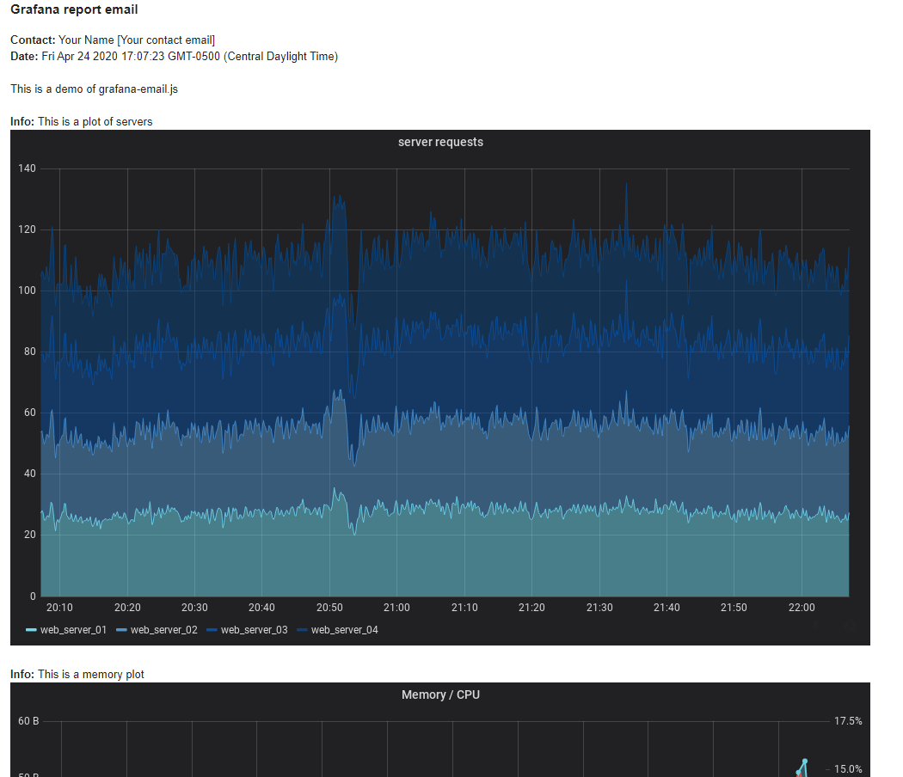

# grafana-email.js

**Intro:** This script allows one to programmatically send images of dashboard tiles in an email. This tool requires the following: 

- Grafana >V6   
- An SM/TP username/password. Example shows using gmail
- NodeJS >V12
- Grafana API key (except in the rare case of an unsecured dashboard like https://play.grafana.org/ )

**Features:**

- Specify an array of panels with descriptions 
- [Optional], sends a test email first to an email of your choosing and awaits confirmation before emailing your provided list

**Example Email:**

<p align='center'>

</p>

## Usage

**Setup:** Clone & npm install 

```console 
git clone https://github.com/NateZimmer/grafana-email.js.git grafana_email
cd grafana_email
npm install
```

**Normal usage:**

```console
node grafana-email.js -file sample_report.json
```

## Configuration 

This script operates based on a config json file that is passed in via the `-file` argument.

Example config: 

```js
{
    "server_url": "https://play.grafana.org", 
    "dashboard_name": "grafana-play-home",
    "dashboard_id": "000000012",
    "email_subject": "Grafana report email", 
    "title": "Grafana report email",
    "intro_text":"This is a demo of grafana-email.js",
    "footer_text": "This was a very neat email. Goodbye",
    "smtp_host": "smtp.gmail.com",
    "smtp_port": 465,
    "smtp_user": "yourSMTP@gmail.com",
    "smtp_password": "[your password]",
    "sender_contact": "Your Name [Your contact email]",
    "_test_email":"your@gmail.com",
    "grafana_api_token": "",
    "email_list":["your@gmail.com","your2@gmail.com"],
    "time_start": "now-2h",
    "time_end": "now",
    "panel_list": [
        {
            "id":2,
            "desc": "This is a plot of servers",
            "height": 600,
            "width": 1000
        },
        {
            "id": 4,
            "desc": "This is a memory plot" 
        },
        {
            "id":3,
            "desc":"Login information"
        }
    ]
}
```

| Key | Required? | Description | 
| ----- | ------ | ------ | 
| `server_url`, | yes | your server URL, be sure to avoid a trailing `/` | 
| `dashboard_name` | yes | dashboard name
| `dashboard_id` | yes | dashboard id, this is a part of the url and is a numeric/alpha-numeric string 
| `email_subject` | yes | email subject |
| `title` | yes | appears at top of email body |
| `intro_text` | yes | explain your email, appears after title |
| `footer_text` | yes | text for end of email | 
| `smtp_host`| yes | your smtp host | 
| `smtp_port` | yes | [int], smtp server port, 465 in case of gmail | 
| `smtp_user` | yes | your smtp username |
| `smtp_password` | yes | plain text password, yes, SAD! | 
| `sender_contact` | yes | opportunity to provide alternate contact info other than smtp address | 
| `_test_email` | no | if present, an email will first be sent to this address for you to review and a cli prompt will require you to confirm before you send it to the provided email list
| `grafana_api_token`| yes | leave as an empty string if you are using an unsecure dashboard |
| `time_start` | no | provide a starting time , `now-2d` 
| `time_end` | no | provide an ending time, `now`
| `panel_list` | yes | an array of panel objects, see next table for description | 

### Panel objects 

The `panel_list` is an array of objects. See below for details  

| Key | Required? | Description | 
| ----- | ----- | ----- | 
| `id` | yes  | panel id, can be viewed in grafana by viewing the json of the panel | 
| `desc` | yes | provide a description for the panel, appears in email above panel | 
| `height` | no | rendered pixel height of panel | 
| `width` | no | rendered pixel width of panel |
| `dashboard_name` | no | allows you to provide an alternate dashboard to pull panel from | 
| `dashboard_id` | no | allows you to provide an alternate dashboard to pull panel from | 

## Support

If there is a feature missing, I recommend you add it yourself. At the end of the day this script is fairly simple. 

## Notes

https://grafana.com/ is an amazing tool brought to us by amazing people. Reality is we all need to eat. Grafana enterprise has some report system but for the rest of us, we have scripts. 